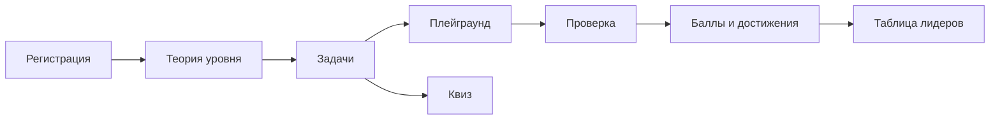

# Продукт GitPlayground

## Ценностное предложение

GitPlayground помогает освоить Git на практике: читать теорию, решать задачи в безопасной песочнице, закреплять термины в квизе и отслеживать прогресс через баллы и достижения.

**Для кого:** новички, джуны и те, кто систематизирует знания перед собеседованиями.

## Путь ученика

1. **Регистрация / вход** — профиль с баллами и публичной страницей.
2. **Теория** (`/theory/<level>/`) — контекст перед практикой уровня.
3. **Задачи** (`/tasks/`) — линейная разблокировка внутри уровня.
4. **Плейграунд** (`/playground/<task_id>/`) — терминал, редактор файлов, проверка решения.
5. **Подсказки** — до двух за баллы, строго по порядку.
6. **Квиз** (`/quiz/`) — термины и сценарии, серии и рекорды.
7. **Таблица лидеров** — рейтинг по баллам профиля (или снимок, если настроен).

## Механики прогресса

| Механика | Где в коде |
| --- | --- |
| Баллы за задачу | `Task.points`, начисление при `validate_task` → PASSED |
| Списание за подсказку | `HINT_UNLOCK_COSTS` в `learn_ops.py` |
| Достижения | `apps/achievements/services.py` |
| Разблокировка задач | `can_open_task`, `get_next_unlockable_task_for_user` |
| Ревизии задач | `TaskRevision` + `TaskRevisionProgress` |

## Ключевые обещания продукта

- **Безопасность** — ученик не получает произвольный shell; только allowlist команд и изолированный workspace.
- **Честная проверка** — валидатор проверяет то, что можно сделать в песочнице.
- **Прозрачный прогресс** — баллы, достижения и таблица лидеров мотивируют продолжать обучение.

## Что не входит в продукт (сейчас)

- Публичный REST API для сторонних клиентов.
- Интеграция с реальными GitHub/GitLab remotes в песочнице.
- Мобильное приложение.

Техническая реализация — в [AGENTS.md](../AGENTS.md) и [FRONTEND.md](FRONTEND.md).
